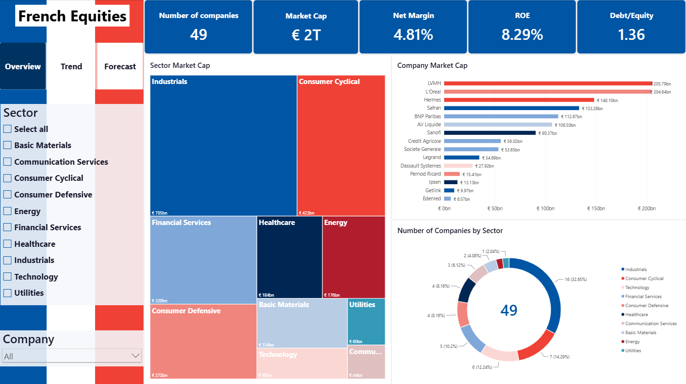
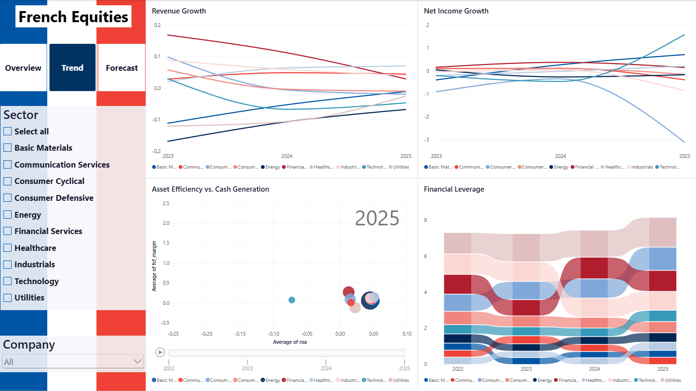
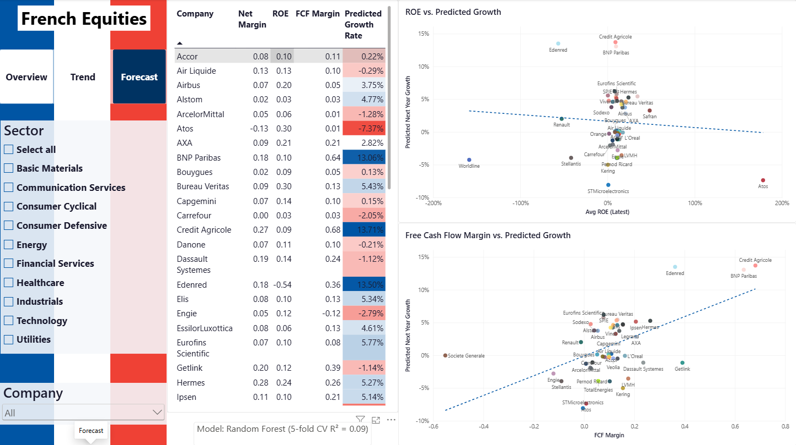

# French Equities Financial Data Analytics Project

End-to-end financial analytics project covering ~50 major French-listed companies (CAC 40 / SBF 120). Built to practice the full Financial Data Analyst workflow: data collection → SQL storage → Python analysis & forecasting → Power BI dashboard.

## Motivation

I'm building this project to combine my accounting/audit background with data analytics skills, exploring how the two fit together in practice. The goal is to simulate a realistic Financial Analysis workflow end-to-end, using real financial data rather than a toy dataset.

## Tech Stack

- **Python** (pandas, yfinance, scikit-learn, matplotlib, seaborn) — data collection, cleaning, ratio analysis, and modeling
- **SQL** (SQLite) — schema design, data cleaning, and structured storage
- **Jupyter Notebook** — exploratory analysis, financial ratios, forecasting
- **Power BI** — interactive dashboard for cross-company comparison

## Repo Structure

| Folder | Contents |
|---|---|
| [`scripts/`](./scripts) | Standalone Python scripts (e.g. data collection from Yahoo Finance) |
| [`data/`](./data) | Raw and processed data files |
| [`sql/`](./sql) | Database schema and data-loading/cleaning scripts |
| [`notebooks/`](./notebooks) | Jupyter notebooks for cleaning, EDA, and forecasting |
| [`powerbi/`](./powerbi) | Power BI dashboard file and screenshots |

## Progress

- [x] **Step 1 — Data Collection**: Pulled ~4 years of annual income statement, balance sheet, and cash flow data for ~50 CAC 40 / SBF 120 companies via the `yfinance` API. See [`scripts/01_fetch_data.py`](./scripts/01_fetch_data.py).
- [x] **Step 2 — SQL Database**: Designed a normalized schema and loaded/cleaned the raw CSVs into SQLite entirely in SQL (no Python). See [`sql/schema.sql`](./sql/schema.sql) and [`sql/load_and_clean.sql`](./sql/load_and_clean.sql).
- [x] **Step 3 — Financial Ratios & EDA**: Computed profitability, return, leverage, liquidity, and growth ratios for each company-year; explored cross-sector and cross-company patterns. See [`notebooks/eda/02_financial_ratios_eda.ipynb`](./notebooks/eda/02_financial_ratios_eda.ipynb).
- [x] **Step 4 — Forecasting**: Pooled/panel regression (Ridge vs Random Forest, scikit-learn) predicting next-year revenue growth from current-year financial ratios across all companies, with company-grouped train/test split and cross-validation. See [`notebooks/03_forecasting_model.ipynb`](./notebooks/03_forecasting_model.ipynb).
- [x] **Step 5 — Power BI Dashboard**: Interactive 3-page dashboard (Overview, Trend, Forecast) connecting to the SQLite database via CSV. See [`powerbi/french_equities_dashboard.pbix`](./powerbi/french_equities_dashboard.pbix).

## Data Source & Design Decisions

- Financial data pulled from Yahoo Finance via the `yfinance` Python library.
- **Annual data only.** Quarterly data was initially considered to get more data points per company, but testing showed most French/EU-listed companies return 0 quarters of usable data via `yfinance`. This is because the EU Transparency Directive (amended in 2013) removed the mandatory quarterly reporting requirement that still applies to US-listed companies — most EU issuers now only publish annual and semi-annual reports. This is a real market/regulatory constraint, not a data-collection bug.
- **Forecasting approach**: because each company only has ~4 years of annual history — too few observations for a per-company time-series train/test split — the project uses a **pooled/panel regression** instead: one row per company-year (~150+ rows across all companies), predicting next-year revenue growth from current-year financial ratios (margin, leverage, size, sector, etc.).
- **SQL schema design**: the raw `yfinance` output is very wide and sparse (income statement ~80 columns, balance sheet ~130, cash flow ~100), since it includes every possible US-GAAP line item even though French companies only report a subset. The SQL schema keeps only 10-15 core financial metrics per statement type. Raw CSVs are loaded into staging tables, then transformed into clean, normalized tables via `CREATE TABLE` + `INSERT INTO ... SELECT`, which also filters out empty artifact rows.
- Companies have different fiscal year-end dates, so calendar years shown may not align 1:1 across all companies; ratios and growth figures are computed per company based on its own reporting calendar, not a shared calendar year.
- **Power BI dashboard scope (49 companies)**: two companies — Michelin (`ML.PA`) and Unibail-Rodamco-Westfield (`URW.AS`) — were missing `sector`/`industry` metadata from `yfinance` (URW.AS was also missing financial statement data entirely, likely due to its REIT structure). Both were excluded from the Power BI layer for a consistent sector-based comparison, while Steps 3-4's Python analysis retains the full ~50-company set. This is a scope difference between the two layers worth noting if the numbers don't match exactly between the notebooks and the dashboard.

## Key Findings

**Profitability by sector**
Financial Services shows the highest median net margin (~17.6%), followed by Consumer Defensive (~10.3%) and Healthcare (~9.7%). Consumer Cyclical is lowest (~1.0%), reflecting thin retail/auto margins versus banking/insurance economics.

**Standout ROE values**
Atos shows an extreme ROE (~178%), almost certainly caused by stockholders' equity being close to zero (consistent with the company's real-world financial distress), which mathematically inflates the ratio rather than reflecting genuinely strong performance — a reminder that ROE should always be read alongside the equity base. Excluding that outlier, top ROE performers are led by Safran, Bureau Veritas, and Hermès.

**Revenue growth**
36% of companies (18 of 50) show negative YoY revenue growth in their most recent fiscal year, concentrated in Technology (Atos, STMicroelectronics), Consumer Cyclical (Kering, LVMH, Stellantis), and Energy (TotalEnergies) — consistent with broader 2025-2026 headwinds in luxury demand and energy prices. Healthcare and Industrials show the strongest median growth.

**Leverage**
The highest debt-to-equity ratios are concentrated in Financial Services (Crédit Agricole, BNP Paribas, Société Générale, 2.4x-4.0x) — expected, since leverage is core to the banking business model. On Net Debt/EBITDA, Vivendi and Getlink stand out with very high ratios (~6.7x-6.9x), well above the ~3x level generally considered a comfort threshold.

**Margin, returns, and growth relationships**
Operating margin and ROA are meaningfully correlated (0.72), suggesting operating efficiency does translate into asset returns. ROE is only weakly correlated with net margin (0.04), suggesting ROE is driven more by financial leverage than by underlying profitability — a useful caveat when comparing ROE across sectors with very different capital structures.

**Forecasting model (Step 4)**
A pooled/panel regression (one row per company-year) was used to predict next-year revenue growth from current-year financial ratios, with a company-grouped train/test split to prevent leakage. Random Forest outperformed Ridge Regression on 5-fold cross-validated R² (mean 0.09 vs -0.08), and is used for forward-looking predictions. An R² in this range means the model explains roughly 9% of the variance in next-year growth — useful as a screening/ranking signal, not a precise forecast, which is an honest and expected result given ~110 training rows and ratio-only features. Prior-year revenue growth (momentum), company size, and FCF margin were the strongest predictors in the Random Forest model; sector was the dominant factor in the Ridge model, with Financial Services and Consumer Cyclical associated with higher predicted growth. Top forward-looking predictions (see `data/processed/growth_predictions.csv`) are led by Crédit Agricole, Edenred, and BNP Paribas.

**Data-quality decisions in the model**
Two explicit outlier-handling steps were applied and documented in the notebook: (1) excluding Vivendi's FY2022→FY2023 transition from training, since its ~-97% revenue change reflects a 2024 corporate demerger rather than organic performance; (2) winsorizing extreme ratio values (2nd-98th percentile) to prevent near-zero-equity distress cases (e.g. Atos, consistent with the ROE outlier flagged in Step 3) from dominating the regression. The same two companies (Atos, Vivendi) also had to be filtered out of the Power BI Trend page specifically, since their extreme values distorted the Y-axis scale for every other company on the same chart.

## Dashboard
[](https://app.powerbi.com/view?r=eyJrIjoiYjBmYTQzODQtODNjZC00YWVjLWFkN2YtM2IwY2YwMGZjMDVlIiwidCI6Ijk2OTJhM2QzLTJhMDgtNGVjOC1hMGJkLTFkYjM1NWViNDIzMCIsImMiOjh9&pageName=2e63ed60169b41785e60)
The Power BI dashboard has 3 pages:

- **Overview** — 5 KPI cards (company count, market cap, net margin, ROE, debt/equity), a treemap of market cap by sector, a Top 15 companies bar chart by market cap, and a donut chart of company count by sector.
- **Trend** — 4 charts covering different angles: revenue growth by sector, net income growth by sector, an animated bubble chart (ROA vs. FCF margin, sized by market cap, playable by year), and a river/ribbon chart of financial leverage (debt-to-equity) by sector over time.
- **Forecast** — a sortable, color-coded table of the model's growth predictions per company, plus two scatter plots with trend lines comparing predicted growth against ROE and against FCF margin, with a note on the model's cross-validated R².

**A key insight the Forecast page makes visually obvious**: the ROE vs. predicted growth trend line is essentially flat (slightly negative), while the FCF margin vs. predicted growth trend line slopes clearly upward. This is a direct visual confirmation of the Step 4 finding that free cash flow generation is a far more meaningful signal of future growth than traditional accounting profitability (ROE, net margin) — a company being profitable on paper doesn't mean it's positioned to grow.

## Dashboard Preview

**Overview**


**Trend**


**Forecast**


## How to Reproduce

```bash
pip install yfinance pandas numpy matplotlib seaborn jupyter scikit-learn
python scripts/01_fetch_data.py
```

This downloads raw annual financial data into `data/raw/`. Then, in DB Browser for SQLite (or any SQLite client):
1. Run `sql/schema.sql` to create the clean tables.
2. Import the 4 raw CSVs as staging tables (see comments in `sql/load_and_clean.sql` for exact table names).
3. Run `sql/load_and_clean.sql` to populate the clean tables.

Then, open and run `notebooks/eda/02_financial_ratios_eda.ipynb` to compute ratios, followed by `notebooks/03_forecasting_model.ipynb` to train and evaluate the growth-prediction model.

Finally, open `powerbi/french_equities_dashboard.pbix` in Power BI Desktop (tables were imported from exported CSVs of the `companies`, `financial_ratios`, and `growth_predictions` SQL tables — see comments in the `.pbix` for the exact source files).

## Author

Thanh Vinh Dang — [LinkedIn](https://www.linkedin.com/in/thanhvinhdang2001)
